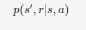
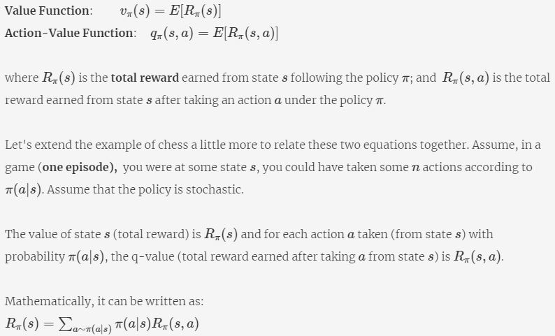
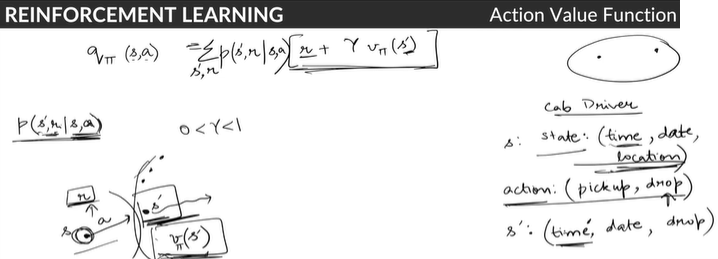
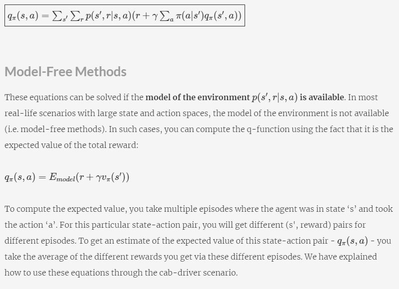

# Markov Decision Process

## Introduction
 In this module, you will learn **Classical Reinforcement Learning**. Reinforcement Learning (RL) is the field of machine learning in which an 'agent' (i.e. the software being trained) learns to take actions to maximise some cumulative 'reward'.  

 Some classical examples of RL are driverless cars, game playing agents (Chess, Go, etc.), mechanical robots in factories/warehouses etc. The field of Reinforcement Learning has seen some major breakthroughs in recent years: 

* [DeepMind and the Deep Q learning architecture](https://deepmind.com/research/publications/human-level-control-through-deep-reinforcement-learning) in 2014, 
* [Beating the champion of the game of Go with AlphaGo](https://deepmind.com/research/case-studies/alphago-the-story-so-far) in 2016 (you can watch the short video related to it [here](https://www.youtube.com/watch?v=8dMFJpEGNLQ)), 
* [OpenAI and the PPO](https://openai.com/blog/openai-baselines-ppo/) in 2017
* How [Deep Blue beat a chess grandmaster](https://en.wikipedia.org/wiki/Deep_Blue_versus_Garry_Kasparov)

These achievements have in turn inspired other researchers and companies to turn to reinforcement learning. The most noticeable is the field of **driverless cars**. Several automobile companies are hard at work for building cutting-edge-technologies for self-driving cars. [Tesla's Autopilot](https://www.tesla.com/autopilotAI) is one such system. Its 'driver assistance system' offers features such as lane-centring, adaptive cruise control, self-parking, etc.  Alphabet's [Waymo, Ford's](https://waymo.com/) self-driving car (which is due out in 2021) are locked in the competition to reach the final level of autonomous driving.

There have been interesting developments in the field of robotics as well, where robots are trained for different tasks such as finding defects in objects, carrying an object from one place to other. [Fanuc](https://www.technologyreview.com/2016/03/18/161519/this-factory-robot-learns-a-new-job-overnight/) has deployed a robot that uses RL to pick a device from one box and put it in a container.

Another domain where RL is used is **finance**. RL is turning out to be a robust tool for evaluating trading strategies. Many companies are leveraging the 'Q-Learning' algorithm of RL with the simple objective of maximising the 'rewards' i.e. profits. You will study Q-learning and some of these applications in this course. 

### The Evolution of RL
The roots of Reinforcement Learning, acronymed as RL, go back to a psychologist, Edward L. Thorndike who talked about **learning by trial and error**.  He studied cats in puzzle boxes. The cat was motivated to come out of the box. The cat would fall around and eventually stumble upon the latch that would open the box. Once the cat managed to get out, the same cat would be put in the same box again. After successive runs, he observed that cats were getting faster in finding and pulling the latch. And on the basis of this [behavioural experiment](https://www.youtube.com/watch?v=fanm--WyQJo), Thorndike put forward the 'Law of Effect':
 
“Responses that produce a satisfying effect in a particular situation become more likely to occur again in that situation, and responses that produce a discomforting effect become less likely to occur again in that situation.”
 
In the first part of this course, you will study classical reinforcement learning techniques - **dynamic programming, Monte Carlo methods, Q-learning** etc. These algorithms are used to teach ‘agents’ how to perform a task. 

In the second part, you will study deep reinforcement learning where you use classical reinforcement learning techniques along with deep learning to manage large state spaces.

### What is Reinforcement Learning?
Ever noticed how an infant learns to walk? She puts a step forward. If she falls, she realises 'that was probably the wrong way'. She keeps trying and relies on the feedbacks (e.g. falling, being able to walk easily, etc.) to judge whether ‘the current technique is correct or not’.
 
You learn from your interactions with the world aka 'environment'. When you are learning to drive a car (assuming you have no instructor), you completely rely on the feedback you get from the surroundings. If you cross a lane or come too close to a tree, you change your technique (or actions, such as putting more breaks, turning the steering a little lesser, etc.).

Let’s first start with an overview of the RL problem and look at some examples which will help build an intuition of  RL.

**Note:**
* The **agent** is any robot that is trying to learn the task,
* While the **environment** is the world around it that gives it the feedback.

When you are learning to walk, you are the agent and the surroundings are the environment.

Reinforcement learning is similar to 'human learning'. Remember the first time you were trying to learn to ride a bicycle? Learning how to balance and manoeuvre comes with experience. Maybe, when you had a fall (a negative experience), you learnt that the action which led to the fall was wrong and you should not do that again. Similarly, when you had a positive experience, you learnt what actions (how to keep your feet on the pedal, how much to turn the handlebar, etc.) led to a happy ride. Let’s look at a few more examples:

#### Humanoid robot example - additional reading
Let’s take one more example: Say, an engineer is learning to design a humanoid robot and his objective is to make it stand. He can do that by turning some joints. A wrong turn of a joint can make it fall. By trial and error experience, he will learn which sequence of turning joints is making robot stand and which is not. This is a reinforcement learning problem. Here, the engineer is the agent and the robot on which he is taking the actions is the environment; actions are 'turning the joints' and consequences could be robot falling or standing up.

### Agent-Environment Interaction
In the last segment, several terms were introduced such as **agent, environment, actions** and **consequences**. In the next few segments, let’s build an intuition for these terms. Before jumping into the equations of RL, it is important that you understand these concepts intuitively.

Let’s first start with the agent-environment interaction.

To summarise, agent **observes** the environment, then takes an action which he thinks is good. After taking the action, the environment tells him how good that action was, in the form of **rewards**; this also presents a new observation to the agent. 

Let’s take the example of a student learning to maximise grades in his training. He has grades of the exam that happened two weeks back. He **observes** the subjects in which he scored lower. And then studies (**action**) only for those subjects. For the remaining time, he plays or surfs. After a week, he goes through the exams again. His grades improve and now only in one subject his marks are a little less than the average. So, the action of studying had a positive consequence as his marks increased.  Apart from this, he observes the subject in which he scored low marks - that becomes his new observation.

**Reward**, in this case, is the increase in marks. However, note that the reward is not enough to judge his action. What if he had failed the subjects for which he did not study in the second attempt? Reward only tells you how well you are carrying out the task. It does not guarantee that this is the best action. In other words, reward is an indicator, or a 'weak signal', which roughly indicates whether the agent is taking actions in the right direction. 

Unlike supervised learning, which classifies each observation as 'right' or 'wrong'; reward in reinforcement learning is just a number indicating how well you are performing the action. The robot needs to try and find out which actions are better than the others, if not the best. The objective here is to maximise the cumulative reward as the sequence of actions is taken.

Note that there are **two types of tasks**:
* **Continuous** - tasks that do not have a definite end - e.g. learning to walk, controlling a chemical plant, driving a car
* **Episodic tasks** - tasks that have a definite end - e.g. most games (videos games, Chess, Ludo) etc. are episodic since at the end of the game the agent either wins or loses. 

### State Vectors
Till now, you were given an overview of the **RL problem** and the agent-environment interaction. Let’s now understand theoretically what is meant by an **observation** and how we formally represent a **reward**.

So, a **state** is a representation of the environment at any point in time. The environment will give all the signals, but how **relevant** those signals are for the agent to take an action is what you have to decide. You can consider state vector as a list of features that help the agent to take an action. For each RL problem, state vector would be different.

Let’s take the example of a humanoid robot where your objective is to make him stand. Now, the environment offers you values for the following:
* pressure & temperature at some chemical plant
* robot’s joint positions
*  the angle at the knee joint
* Bitcoin’s current price

Would all these variables impact the agent’s decision making? No. The pressure and temperature at the chemical plant would not help you decide which joint to turn. The action you need to make is on the basis of ‘which joint of the robot should be turned’. So, your 'state' will be the representation of robot’s joint positions and the angle at knee joint. These two are enough to take the next action.

State is **your** representation of the environment. Perhaps the environment would have a lot of things, but the state that you want to take will determine which parameters in the environment really matter to you.

So, the representation of the environment which is necessary for the agent to take an action is called state. In any real-life scenario, it will be left on your judgement to decide what variables are good for the agent to take an action.

### Objective of RL Agent
So far, you have learnt that the agent is interacting with the environment in an 'optimal manner' to achieve the objective. But, how do you define the **objective of an RL problem?** Can you say that the objective is to gather maximum rewards?

Take an episodic task, say a game of tic-tac-toe. How will you calculate the reward for each **O (or X)** you marked? You will get a reward after you win or lose the game. What is the agent’s end-objective in this case? Similarly, for a continuing task, say for stock market trading, you can define your reward as how much profit you earned in a month or a day. There is no end to continuing tasks, so how are you going to parametrise your objective?

We can summarise the objectives of the RL agent in the following manner:
* The objective of **episodic tasks** is to find such a sequence of actions that will make the majority of episodes successful.
* For **continuing tasks**, break it into multiple episodes and then find out actions that maximise the average rewards earned from those episodes.

### Actions & Policy
So far, you have two pieces of information:
1. An action leads to a reward and a change in state.
2. The objective of the RL agent is to find the sequence of actions to maximise overall rewards.

Both have something in common which we have still not discussed in detail – **actions**.

How does an RL agent take an action from a given state? Are there some rules defined for each scenario?  Or is there some mathematical model of the environment which the agent learns over time and then takes an action? We will handle all these questions.

Agent needs to learn about the environment before it behaves in an optimal manner. Learning essentially means that the agent interacts with the environment by trying out different actions and understanding their consequences. 

The consequence is two-fold, one in form of **rewards**, other in form of **change of state**. It is like a child learning how to walk. He needs to understand which foot to put forward, to keep both the legs straight, etc., and the consequence for each of these. So, he will remember what action he took and what consequence it led to. This memory of action and consequence is called **knowledge-base** or **history** for an RL agent.

Now, the agent can look up in its knowledge base and see which action leads to the best consequence when in a given state. You could also build a **mathematical model** of the environment rather than storing all possible (action, consequence) pairs. We will discuss how to do that in a while. 

A **policy** is a set of rules which helps the agent decide the action that it should take in a given state such that the agent can maximise its rewards in the long run. There are two types of policies:

For example, for a novice doing investment portfolio management, the policy could be: whenever the stock price reaches a certain threshold, he will sell all the stock. This is the deterministic case. He has fixed the action for a state. A probabilistic policy, on the other hand, could be: whenever the stock price reaches a certain threshold, sell the stock 60% of the times, retain the stock 35% of the times, and for rest of the times, buy the stock. What if the stock price keeps on increasing and he holds the stock rather than selling it? Well, he could earn more profit by selling it later.

### Exploration vs Exploitation
In the last segment, you studied two types of policies - **deterministic** and **stochastic**. You also understood why a stochastic policy is preferred over a deterministic one in most practical cases. In this segment, we will discuss another reason why a stochastic policy is better.

Let’s first build an intuition of this discussion. Let's say you love Indian food. You have the following policy (based on, say, Zomato reviews) to choose a restaurant when in a given mood:

This is your current policy. Say, you are happy, and you decide to go out for a family dinner. The most obvious choice is “Smoke House Deli” as per the policy. Now, on some day, you thought of giving “Delhi House” a try. You went there, and you loved the food much more than that of “Smoke House Deli”. If you wouldn’t have ‘explored’ this option, probably, you would have never had that tasty Indian food!

(P.S. This example is just for illustration. Not to point out whether Smoke House Deli is better or Delhi House.)

This concept of exploration will set the grounds for why a stochastic policy is often better than a deterministic one.

**Exploration-Exploitation Tradeoff**: Exploiting an action is fine if you have exhaustively explored all the actions from a given state. But, this is generally not the case in real-life situations. In most scenarios, you would have explored only a small fraction of all possible actions. What if there exists an action that can get you a lottery? Wouldn’t you go exploring more? But at the same time, you also don’t want to lose out on the benefits of the current action, in case you don’t find good options while exploring.

So, to handle this problem, typically, a small window of exploration is set. We will go into the mathematical formulation later, but for now, let’s stick only to the theoretical concept of exploration vs exploitation.

### Markov State
In the previous segment, you learnt that when in a given state, an agent takes an action according to a policy (which is learnt during training - we will discuss training algorithms later). The action leads to a change in state and possibly generates a reward. One bruteforce way to learn a policy is to actually remember all the possible pairs of state, action and reward. But that is often not feasible. For example, in a game of (say) Chess, this set may comprise of a million possible combinations. In more complex problems (such as playing Go, driving a car etc.) this may be further intractable. Therefore, in the RL problem, we make a **Markovian** assumption. 

Let's now understand what is Markov assumption and how can we define the Markov assumption for RL problems.

The **Markov assumption** states that the current state contains all the necessary information about all the past states the agent was in and all the past actions the agent took. It assumes that the current state is sufficient for taking the next action.

You can consider a Markov state as some function of the knowledge base that captures all relevant information from the knowledge base. And once ‘Markov state’ is known, the knowledge base can be thrown away. What action the agent needs to take next or what possible state an agent can land on given he has taken an action - all of this can be determined from the **Markov state**.

Let’s consider a robot learning to fly a plane. It has the knowledge base of **position, the speed** at each and every time step. Now, at some position, the robot makes a right turn. The next state of the plane will be dependent on what the current position and speed of the plane are, and the robot has taken the right turn. It doesn’t need to know how it arrived at the current position or how it gained its current speed. Its current state vector (current position, current speed) and action satisfy the Markovian assumption.

Now, let’s revisit some examples we have discussed earlier and see whether the Markov assumption holds in all those cases.

All these processes that work in accordance to Markov property are called **Markov Decision Processes** (popularly called **MDPs**). The word ‘Decision’ in MDP takes into account actions taken by the agent in a given Markov state. MDP is the formal name of a sequential decision-making process. All the RL problems set its ground on MDPs, i.e., work on the assumption of the Markov property. We will uncover more on MDPs in later segments.

### Markov Decision Process (MDP)
So far, everything has been explained to develop an intuition of all the important ideas. From this segment onwards, we will build the mathematical formalisation of all that you have studied. Before we do that, let’s encapsulate the learning so far.

The following points apply to an RL problem:
* An agent learns how to behave in an environment by taking actions.
* Then observing the consequences (rewards and next state), of the action taken.
* The control objective of the agent is to learn a policy to accumulate maximum cumulative rewards over a period of time.
* All of RL problems are based on the Markov assumption: the current state contains all relevant information to take the best action.

### Value Function
Let’s say an agent is learning to play a game where it has to fight enemy's drones in a battlefield. Assume that his current location and the number of bullets in his gun defines his state. His action could be - to move forward or to shoot. The reward is the number of drones he shot without getting killed. Let’s say he found a position behind a wall and he can shoot as many drones as he wants without getting killed. 

The position behind the wall has offered him an advantage and is more valuable to him. On the other hand, the agent once found himself out in the middle of the battlefield where he was an easy target for the drones.

This implies that some states are inherently more **valuable** than others, i.e. the agent prefers some states over others. It will be useful if the agent learns the 'values' of all these states. In the upcoming segment, we will explain the concept of 'value' in detail. 

### State value function
Value function helps in evaluating a state. Consider the following table. 

Assume that you want to reach cell 9 from the current state (which is cell 5). Assuming you can take actions only from the following set {Left, Up, Down, Right}, the possible next states you can be in, starting from cell 5, are - cell 2, cell 4, cell 6, cell 8. You evaluate all the states, based on how valuable each of these states would be in achieving the final goal of reaching state/cell 9.

Clearly, if you move to cell 4 (or 8), the chances of reaching cell 9 in the next step are higher than if you were in cell 2 or 6.  

The positional advantage you have simply by being in a particular state is the intrinsic **value of the state**. For example, it is far more valuable to be in state 4 as opposed to state 3, because the immediate step after 4 will result in achieving the target i.e. state 9. So, state 4 is inherently more valuable than state 3. So, you can select an action that helps you achieve the state with the maximum 'value'. 

A value function tells you how good it is for the agent to be in that particular state. It is also known as the **state value function**. The agent would want to be in a state such that its **total rewards (immediate + expected future rewards) are maximised**.

#### Total rewards

Consider that the agent starts from state S0, takes an action A0 and gets an immediate reward of R0 and ends up in state S1. From there he takes action A1 and so on. So, his episode is:

(S0, A0, R0), (S1, A1, R1), (S2, A2, R2), (S3, A3, R3), (S4, A4, R4), S5

where S5 is the terminal state.

Now, you want to calculate total rewards earned from State S2, that will be: (R2)+ (R3+R4). Here R2 is an immediate reward and (R3+R4) are future rewards.

#### Action value function
On a similar note, we can define a value function for action, i.e., define how valuable it is to perform an action in a particular state. Consider the game of chess - you moved your rook to take the opponent’s queen and got an immediate high reward for this move. But taking this action might have been useful in some other state, but in this state (where the King gets endangered) this action is quite unfavorable.

Let's understand **action value function** in detail.

You take actions that bring about states with high value, i.e. actions that fetch high immediate reward + expected future rewards because these actions bring the greatest amount of reward over the long run.

Consider the above example: If you (the agent) are in state 5, let’s say you have the choice of performing 4 actions in that state. You can go either left, right, up or down. All actions are not equally valuable. Some actions can make you closer to the target. So, in state 5, actions ‘up’ and ‘right’ will take you closer to the target cell 9, while the actions ‘down’ and ‘left’ will take you away from the target cell. So when you are in state 5, actions ‘up’ and ‘right’ are more valuable.

This function calculates the intrinsic value of performing an action when you are in state ‘s’. Also known as the **q-function, q(s, a)** is the **reward you can expect** if you take an action ‘a’ in state ‘s’.

For example, if you are near the airport at 6:30 pm in the evening, the action of going to the airport by 8 pm is very valuable. Why? Because many flights land at around 8 pm in the evening, so the cab driver will be expected to get many long-distance rides at 8 pm if he is at the airport at that time.

To summarise, 
* The **state-value function** v(s) is the total reward an agent can expect if it is in state s
* The **action-value function** q(s, a) is the total reward an agent can expect if it performs an action ‘a’ when it is in the state ‘s’

Once you fix the policy, the value and the q-function are fixed. 

So, if there are two cab drivers at the airport at 8 pm. Of which, one has the policy of earning maximum profit, while the other’s policy is to finish his day’s job by 9 pm. If you compute value function for each, they would be different for both, as the action they both would give priority to would be different, though being in the same state. One cab driver will be earning the profit, others will drive towards his home. 

### Optimal Policy
The objective of an RL agent is to find the best action to take in a given state, i.e. to learn an optimal policy. In the segment,we will explain what is meant by **optimal policy**.

But, **π** is just a mapping (of what actions to take in a given state). How can we compare two mappings? We must have some metric to say one policy is better than another. In the following segment, we will explain how to compare two policies.

### Model of the Environment
There are broadly two types of frameworks in RL: **model-based** and **model-free**.
* In **model-based methods**, it is possible to learn what is called a model of the environment, i.e. a model which maps the consequences (next state, reward) of taking an action in a state.
* In **model-free methods**, it is not possible to learn an explicit model (which is a more realistic case).

Let's learn about them.

In most cases, the environment is stochastic, i.e., most of the times you will see different rewards and states after taking a particular action in a particular state. Therefore, the model is represented as: 

It is the probabilistic distribution of finding the agent in state 's' and reaping the reward r, given a particular action a is taken in a particular state s. This is known as **the model of the environment**.

In most real-world scenarios, you wouldn’t know what exactly the model of the environment is. You implicitly infer about the model from the observations and the RL techniqes used to solve such problems are called **model-free**. 

So, the objective of an RL agent is to find the optimal policy either using the explicit model (model-based) or by implicitly inferring the model from the actions taken from various states (model-free). 

In the subsequent sessions, you will learn about the RL equations and how to solve them using Model-based or Model-free methods.

### RL vs Supervised Learning
Before we start with the mathematics of Reinforcement Learning, it is essential to understand what makes RL different from supervised learning.

Let’s summarise the differences you learnt till now:
* In **reinforcement learning**, you deal with the **processes** where the **agent actively interacts** with the environment. Whereas in **supervised learning**, you deal with **objects or datasets**. There is **no interaction** with the environment and given a dataset, you are required to predict the target.
* RL is an active learning, where the agent learns only by interacting. While supervised learning is passive learning, where the agent learns only by extracting features from a given dataset.

The next major difference between the two learning methods is **how the performance of the two is measured**.
* In supervised learning, there is a **teacher (ground-truth)** which tells you whether the result for a given observation is correct or not. And, then the model can be improved by minimising the error term. 
* On the other hand, in reinforcement learning, there is no teacher. The environment acts only as a **critic**, where it tells you how good or bad the action is by giving rewards. It doesn’t tell whether the action taken is the ultimate best or not.

### Inventory Management (MDP) -I
In this segment, you are going to formulate an MDP for an **inventory management** problem.

A major concern of a warehouse owner is how much stock to order from the supplier to meet the customer demand and at the same time minimise his costs. The warehouse owner needs to **learn the demand pattern** and order accordingly. What if he was given a reinforcement learning agent who would learn from history how the demand has been and place orders accordingly?

Thought to ponder: Why not apply time series prediction and predict the future demand?

We could. But every few months the market conditions change. Will you apply time-series every month to adjust to the latest conditions? Reinforcement learning agent will constantly learn from the environment and update its demand curve.

With this let's start detailing out the problem statement.

The objective of the agent is to maximise profits and minimise the costs. Let's understand what all costs the owner incurs.

The revenue made by the warehouse manager depends upon the number of items he is able to sell. And the costs that will be incurred are:
* Buying cost from the supplier (b)
* Holding cost (d)
* Return cost (r)
* Delivery cost (s)

In the next segment, you will define the **MDP parameters**: state, action, transition probabilities and the reward structure.

### Inventory Management (MDP) -II
Let's continue defining our MDP for the inventory management problem.

So, the state in this MDP is: **(Inventory size, day-of-the-week)**. Basis these two features, the storekeeper can decide how much order to place. We will consider this state as Markovian.

Let's now define what could be the transition probability in this case.

Let's now look at the reward structure. Remember the following notations for the profit and the costs:
* Buying cost from the supplier (b)
* Holding cost (d)
* Return cost (r)
* Delivery cost (s)
* Opportunity cost (o)
* Profit (p)

### Fundamental Equations in RL
In this session, you will learn some of the fundamental equations in Reinforcement Learning. 

You will learn how to calculate **value function** (of a state) and also the **q-value** (of a state-action pair). You will see how these two terms can be related to each other for a given policy. You will also understand the concept of **discounted rewards**. 

You will also learn how to find an optimal policy for a given RL problem. You will learn about **Policy Improvement Theorem**. These equations and their ideas will be used later when we apply model-based techniques (such as Policy Iteration or Value Iteration) or model-free methods (such as Monte-Carlo & Temporal Difference).  

### RL Equations - State Value Function
With grounds set for the reinforcement learning problem, let’s start with some basic equations relating :

**Expected value**
Let's try to understand this through the game of Chess:

Every time you play the game starting from the same board position (**same state**) and with the **same policy** (stochastic or deterministic), the end **outcome will be different** (total rewards will be different) because you don’t know how the opponent is going to play. In most of the scenarios, the environment is stochastic (the opponent’s move will decide the agent’s next state which is not deterministic), so every time you run an episode from the state **s** following policy **π**, you will get different immediate and future rewards, thereby different total rewards. 

Hypothetically, say you get a total reward of 10, 20, 15, 5, 30 in the first 5 games starting from the state 's'. The average reward is 16. What if the game is played infinite number of times, what will the average be? According to the law of large numbers, the average value will converge to the expected value.

The same principle applies here. If you run a large number of episodes (play a large number of games) from the state **s** following the policy 
**π**, the **expected total reward will be the value of that state under the policy π** . Similarly, you can think of q-values.

Mathematically, the two functions are defined as follows:

This is the first basic equation of RL. The intuition of this equation is that the value function of a state **s** is the weighted sum over all action-value functions for different actions that can be taken from state **s**.
 
### RL Equations - Action Value Function
In the previous segment, we had derived the equation for state value function:

Let's summarise the important points using some examples.

This **discount factor** determines the importance of future rewards, i.e. how much you value the future rewards.

Another important feature of having **a discount factor is for continuous tasks**. When total rewards are calculated for continuous tasks, the total rewards may not converge. So, the discount factor will keep the total rewards bounded.

This is a single game. But the opponent won't be playing with the same strategy every time, right? The same applies to the environment.

The same state-action pair can yield very different (successive state-reward) pairs. You need to **average over all these combinations** to get a sense of the value of performing an action in a particular state. 

This is the **second fundamental equation** in RL. The intuition of this equation is that the action-value function for an action **a** taken from state **s** is the weighted sum of total reward (immediate reward + discounted future reward) over model probabilities.

To summarise:
* **q-value**- an estimate of the value of **an action**, that can be performed, in a given state.
* **state-value**- an estimate of the value of the state, by taking the weighted sum of the expected value of **all the actions**

### Understanding the RL Equations
In the last few segments, we defined the state-value and action-value functions for a given policy as:

In this segment, you will learn how to use both of these equations together for an RL problem.

Let’s summarise the important points discussed until this point:

**Cab-Driver Example**

Consider the example of a cab driver. She has to go from point A (state A) to point B (state B). Here one episode means that the driver is going from state A to state B. The driver performs 100 such episodes. The policy that she is following is stochastic. Let’s assume that she encounters state C in most of these episodes. When in state C, in some episodes she takes the action RIGHT, while in a few others she takes the actions UP, LEFT, DOWN. You want to calculate the state-value of state C.

To calculate the state-value of state C, you calculate the reward associated with the pair (state C, RIGHT), (state C, LEFT), (state C, UP) and (state C, DOWN) in all episodes corresponding to each of the state-action pairs. 

* q(state C, RIGHT) = average value of the rewards corresponding to this state-action pair in all the episodes
* q(state C, LEFT) = average value of the rewards corresponding to this state-action pair in all the episodes
* q(state C, UP) = average value of the rewards corresponding to this state-action pair in all the episodes
* q(state C, DOWN) = average value of the rewards corresponding to this state-action pair in all the episodes 

**Formal justification of using q-value not value-function in model-free methods:**
Now, to compute the value function, you need to evaluate q-function. And given that you don't have the model of the environment, you can't directly evaluate q-function, thereby, can't substitute q-function in value function equation. And this is a typical scenario. 

Intuitively, with a model, value-function is enough to find an optimal policy, as the agent can look ahead one step and choose the action that leads to the best combination of reward and state. But without a model, the agent needs to estimate the value of each action to find an optimal policy.

### Bellman Equations of Optimality
Till now, you have learnt how to calculate state-value and action-value functions for a policy **π** . In this segment, you will learn to write similar equations for an **optimal policy**.

Optimal policy refers to finding the best action **a** in state **s** . In this case, as is the case for many MDPs, the optimal policy is deterministic, i.e., there is only one optimal action to take in each state. 

With this as the basis, let’s start building equations for optimal state and action-value functions.

Value of a state under an optimal policy must be equal to the expected total return for the best action from that state. At each state, **greedily pick the best action** that has the maximum q-value. 

### Solving Bellman Equations
So far, you have learnt the fundamental equations in Reinforcement Learning. In the subsequent segments, you will learn to solve these equations. Let’s briefly recap what all you have learnt till now.

All these equations work together to arrive at optimal policy and optimal value functions. You will learn to solve these equations to achieve optimal policy in the next two sessions. For now, it's important to reiterate that there are broadly two steps involved in arriving at optimal policy and state-value functions:

* **Policy Evaluation**: Say you know a policy and you want to evaluate how good it is, i.e., compute the state-value functions for the existing policy
* **Policy Improvement**: Say you know the value function for each state and you want to improve the policy which was used to compute these value functions, i.e., improve the policy using the existing state value function. This new policy could not have been found directly from the old policy without calculating those value functions.

The process of learning an optimal policy is analogous to learning to play, say, Chess. You want to learn the optimal policy (i.e. learn to play well), and to do that you need to know the ‘values’ of the various states (i.e. get an intuition of which states are good). So you start playing with some policy (the initial ones are likely to be bad) and compute the ‘state-values’ under that policy. Once you have played enough games under a policy, you can try changing your policy, compare that with other policies, and gradually improve your policy.

### Policy Improvement
In the last segment, we mentioned that you could repeatedly do **policy evaluation** and **policy improvement** steps to arrive at the optimal policy. 

Given that you know the value function for each state, let’s now learn to do policy improvement.

As the name suggests, **policy improvement** is done to **maximise the total rewards**, by finding the best action for each state.

Consider that the agent is at state s following some policy **π**. The value function at state s is given by:

