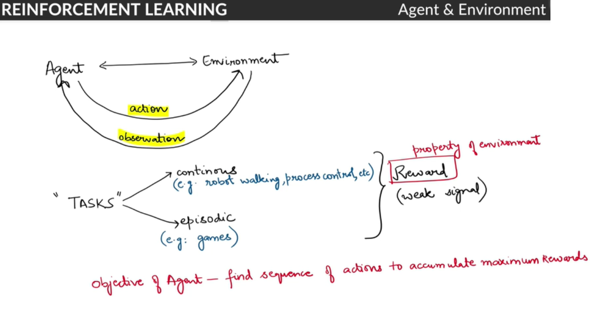

# Markov Decision Process

## Introduction
 In this module, you will learn **Classical Reinforcement Learning**. Reinforcement Learning (RL) is the field of machine learning in which an 'agent' (i.e. the software being trained) learns to take actions to maximise some cumulative 'reward'.  

 Some classical examples of RL are driverless cars, game playing agents (Chess, Go, etc.), mechanical robots in factories/warehouses etc. The field of Reinforcement Learning has seen some major breakthroughs in recent years: 

* [DeepMind and the Deep Q learning architecture](https://deepmind.com/research/publications/human-level-control-through-deep-reinforcement-learning) in 2014, 
* [Beating the champion of the game of Go with AlphaGo](https://deepmind.com/research/case-studies/alphago-the-story-so-far) in 2016 (you can watch the short video related to it [here](https://www.youtube.com/watch?v=8dMFJpEGNLQ)), 
* [OpenAI and the PPO](https://openai.com/blog/openai-baselines-ppo/) in 2017
* How [Deep Blue beat a chess grandmaster](https://en.wikipedia.org/wiki/Deep_Blue_versus_Garry_Kasparov)

These achievements have in turn inspired other researchers and companies to turn to reinforcement learning. The most noticeable is the field of **driverless cars**. Several automobile companies are hard at work for building cutting-edge-technologies for self-driving cars. [Tesla's Autopilot](https://www.tesla.com/autopilotAI) is one such system. Its 'driver assistance system' offers features such as lane-centring, adaptive cruise control, self-parking, etc.  Alphabet's [Waymo, Ford's](https://waymo.com/) self-driving car (which is due out in 2021) are locked in the competition to reach the final level of autonomous driving.

There have been interesting developments in the field of robotics as well, where robots are trained for different tasks such as finding defects in objects, carrying an object from one place to other. [Fanuc](https://www.technologyreview.com/2016/03/18/161519/this-factory-robot-learns-a-new-job-overnight/) has deployed a robot that uses RL to pick a device from one box and put it in a container.

Another domain where RL is used is **finance**. RL is turning out to be a robust tool for evaluating trading strategies. Many companies are leveraging the 'Q-Learning' algorithm of RL with the simple objective of maximising the 'rewards' i.e. profits. You will study Q-learning and some of these applications in this course. 

### The Evolution of RL
The roots of Reinforcement Learning, acronymed as RL, go back to a psychologist, Edward L. Thorndike who talked about **learning by trial and error**.  He studied cats in puzzle boxes. The cat was motivated to come out of the box. The cat would fall around and eventually stumble upon the latch that would open the box. Once the cat managed to get out, the same cat would be put in the same box again. After successive runs, he observed that cats were getting faster in finding and pulling the latch. And on the basis of this [behavioural experiment](https://www.youtube.com/watch?v=fanm--WyQJo), Thorndike put forward the 'Law of Effect':
 
“Responses that produce a satisfying effect in a particular situation become more likely to occur again in that situation, and responses that produce a discomforting effect become less likely to occur again in that situation.”
 
In the first part of this course, you will study classical reinforcement learning techniques - **dynamic programming, Monte Carlo methods, Q-learning** etc. These algorithms are used to teach ‘agents’ how to perform a task. 

In the second part, you will study deep reinforcement learning where you use classical reinforcement learning techniques along with deep learning to manage large state spaces.

### What is Reinforcement Learning?
Ever noticed how an infant learns to walk? She puts a step forward. If she falls, she realises 'that was probably the wrong way'. She keeps trying and relies on the feedbacks (e.g. falling, being able to walk easily, etc.) to judge whether ‘the current technique is correct or not’.
 
You learn from your interactions with the world aka 'environment'. When you are learning to drive a car (assuming you have no instructor), you completely rely on the feedback you get from the surroundings. If you cross a lane or come too close to a tree, you change your technique (or actions, such as putting more breaks, turning the steering a little lesser, etc.).

Let’s first start with an overview of the RL problem and look at some examples which will help build an intuition of  RL.

**Note:**
* The **agent** is any robot that is trying to learn the task,
* While the **environment** is the world around it that gives it the feedback.

When you are learning to walk, you are the agent and the surroundings are the environment.

Reinforcement learning is similar to 'human learning'. Remember the first time you were trying to learn to ride a bicycle? Learning how to balance and manoeuvre comes with experience. Maybe, when you had a fall (a negative experience), you learnt that the action which led to the fall was wrong and you should not do that again. Similarly, when you had a positive experience, you learnt what actions (how to keep your feet on the pedal, how much to turn the handlebar, etc.) led to a happy ride. Let’s look at a few more examples:

#### Humanoid robot example - additional reading
Let’s take one more example: Say, an engineer is learning to design a humanoid robot and his objective is to make it stand. He can do that by turning some joints. A wrong turn of a joint can make it fall. By trial and error experience, he will learn which sequence of turning joints is making robot stand and which is not. This is a reinforcement learning problem. Here, the engineer is the agent and the robot on which he is taking the actions is the environment; actions are 'turning the joints' and consequences could be robot falling or standing up.

### Agent-Environment Interaction
In the last segment, several terms were introduced such as **agent, environment, actions** and **consequences**. In the next few segments, let’s build an intuition for these terms. Before jumping into the equations of RL, it is important that you understand these concepts intuitively.

Let’s first start with the agent-environment interaction.

To summarise, agent **observes** the environment, then takes an action which he thinks is good. After taking the action, the environment tells him how good that action was, in the form of **rewards**; this also presents a new observation to the agent. 

Let’s take the example of a student learning to maximise grades in his training. He has grades of the exam that happened two weeks back. He **observes** the subjects in which he scored lower. And then studies (**action**) only for those subjects. For the remaining time, he plays or surfs. After a week, he goes through the exams again. His grades improve and now only in one subject his marks are a little less than the average. So, the action of studying had a positive consequence as his marks increased.  Apart from this, he observes the subject in which he scored low marks - that becomes his new observation.

**Reward**, in this case, is the increase in marks. However, note that the reward is not enough to judge his action. What if he had failed the subjects for which he did not study in the second attempt? Reward only tells you how well you are carrying out the task. It does not guarantee that this is the best action. In other words, reward is an indicator, or a 'weak signal', which roughly indicates whether the agent is taking actions in the right direction. 

Unlike supervised learning, which classifies each observation as 'right' or 'wrong'; reward in reinforcement learning is just a number indicating how well you are performing the action. The robot needs to try and find out which actions are better than the others, if not the best. The objective here is to maximise the cumulative reward as the sequence of actions is taken.

Note that there are **two types of tasks**:
* **Continuous** - tasks that do not have a definite end - e.g. learning to walk, controlling a chemical plant, driving a car
* **Episodic tasks** - tasks that have a definite end - e.g. most games (videos games, Chess, Ludo) etc. are episodic since at the end of the game the agent either wins or loses. 

### State Vectors
Till now, you were given an overview of the **RL problem** and the agent-environment interaction. Let’s now understand theoretically what is meant by an **observation** and how we formally represent a **reward**.

So, a **state** is a representation of the environment at any point in time. The environment will give all the signals, but how **relevant** those signals are for the agent to take an action is what you have to decide. You can consider state vector as a list of features that help the agent to take an action. For each RL problem, state vector would be different.

Let’s take the example of a humanoid robot where your objective is to make him stand. Now, the environment offers you values for the following:
* pressure & temperature at some chemical plant
* robot’s joint positions
*  the angle at the knee joint
* Bitcoin’s current price

Would all these variables impact the agent’s decision making? No. The pressure and temperature at the chemical plant would not help you decide which joint to turn. The action you need to make is on the basis of ‘which joint of the robot should be turned’. So, your 'state' will be the representation of robot’s joint positions and the angle at knee joint. These two are enough to take the next action.

State is **your** representation of the environment. Perhaps the environment would have a lot of things, but the state that you want to take will determine which parameters in the environment really matter to you.

So, the representation of the environment which is necessary for the agent to take an action is called state. In any real-life scenario, it will be left on your judgement to decide what variables are good for the agent to take an action.

### Objective of RL Agent
So far, you have learnt that the agent is interacting with the environment in an 'optimal manner' to achieve the objective. But, how do you define the **objective of an RL problem?** Can you say that the objective is to gather maximum rewards?

Take an episodic task, say a game of tic-tac-toe. How will you calculate the reward for each **O (or X)** you marked? You will get a reward after you win or lose the game. What is the agent’s end-objective in this case? Similarly, for a continuing task, say for stock market trading, you can define your reward as how much profit you earned in a month or a day. There is no end to continuing tasks, so how are you going to parametrise your objective?

We can summarise the objectives of the RL agent in the following manner:
* The objective of **episodic tasks** is to find such a sequence of actions that will make the majority of episodes successful.
* For **continuing tasks**, break it into multiple episodes and then find out actions that maximise the average rewards earned from those episodes.

### Actions & Policy
So far, you have two pieces of information:
1. An action leads to a reward and a change in state.
2. The objective of the RL agent is to find the sequence of actions to maximise overall rewards.

Both have something in common which we have still not discussed in detail – **actions**.

How does an RL agent take an action from a given state? Are there some rules defined for each scenario?  Or is there some mathematical model of the environment which the agent learns over time and then takes an action? We will handle all these questions.

Agent needs to learn about the environment before it behaves in an optimal manner. Learning essentially means that the agent interacts with the environment by trying out different actions and understanding their consequences. 

The consequence is two-fold, one in form of **rewards**, other in form of **change of state**. It is like a child learning how to walk. He needs to understand which foot to put forward, to keep both the legs straight, etc., and the consequence for each of these. So, he will remember what action he took and what consequence it led to. This memory of action and consequence is called **knowledge-base** or **history** for an RL agent.

Now, the agent can look up in its knowledge base and see which action leads to the best consequence when in a given state. You could also build a **mathematical model** of the environment rather than storing all possible (action, consequence) pairs. We will discuss how to do that in a while. 

A **policy** is a set of rules which helps the agent decide the action that it should take in a given state such that the agent can maximise its rewards in the long run. There are two types of policies:

